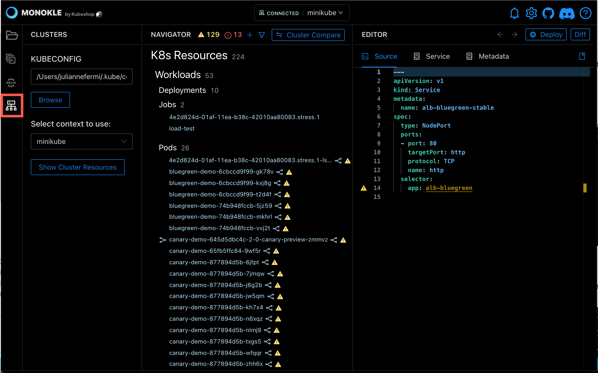
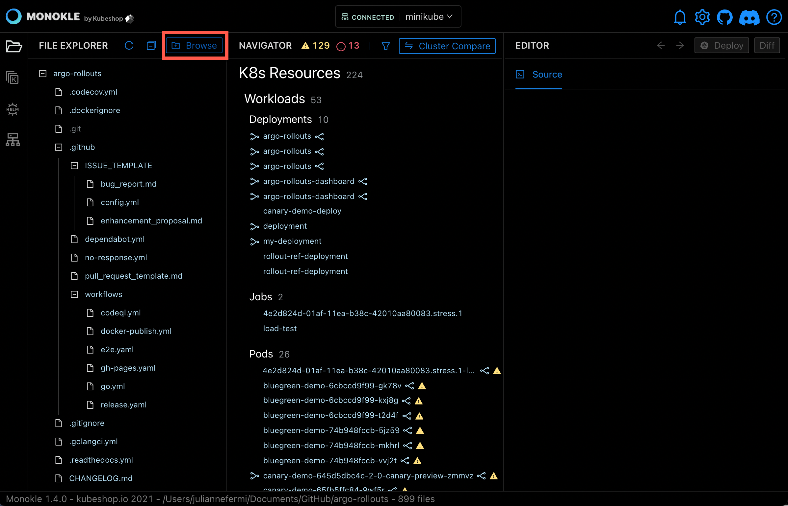

# Cluster Integration

Although Monokle is mainly geared at working with manifest files, it also has the capability to connect 
to a cluster and show all contained resources, providing a convenient and easy way to inspect cluster resources.

Selecting the "Cluster Preview" button in the left toolbar replaces the File Explorer with a Clusters tab:

- The kubeconfig field sets which kubeconfig to use for cluster interactions (this is the same as in the global settings).

Selecting the "Load" button will attempt to populate the Resource Navigator with objects from the configured cluster:

Monokle is now in "Cluster Mode" (as indicated by the header at the top):

- The File Explorer has been disabled if a folder had been previously selected.
- The Navigator contains all resources retrieved from the configured cluster:
  - Resource navigation works as with files; selecting a resource shows its content in the source editor.
  - Resource links are shown as before with corresponding popups/links/etc.
- Selecting "Exit" in the top right restores the contents of the Resource Navigator to the currently selected folder.

You can also exit Cluster Mode by selecting the File Explorer in the left toolbar and selecting a new folder with the "Browse" button: 

While in Cluster Mode, select the "Reload" option to refresh cluster resources.

## Saving Multiple Resources

In Cluster Mode, select multiple resources with the check box(es) to the left of the resource(s), pick the folder to save to from the dropdown list and click "Ok".

