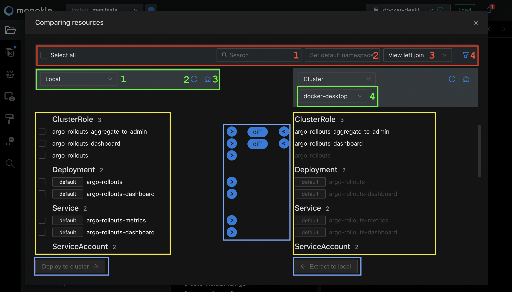
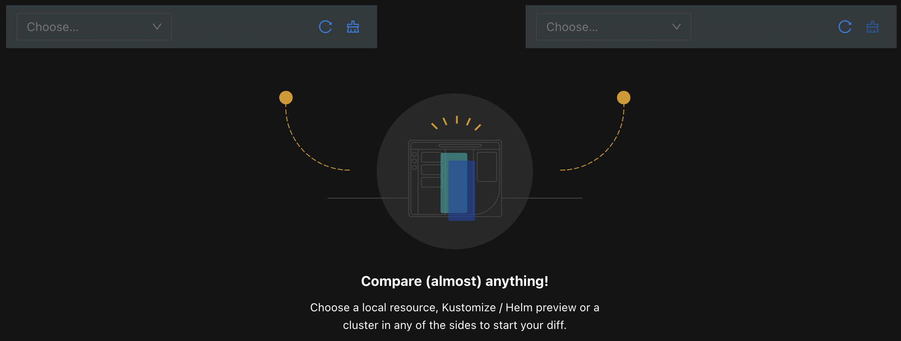

# Compare & Sync

The Compare & Sync functionality allows you to compare and synchronize two sets of resources.

Each set of resources can be one of the following:
- Resources from your local manifest files.
- Resources from a cluster.
- Resources from the [Preview](helm.md) of a Helm Chart.
- Resources from the [Preview](kustomize.md) of a Kustomization.

Here are some of the scenarios where Compare & Sync can help you:
1. Compare local resources to the resources in your cluster AND:
  - Deploy local resources to the cluster.
  - Extract cluster resources to local.
2. Compare resources between two clusters AND:
  - Deploy resources from one cluster to another.
3. Compare resources between a Helm Chart or Kustomization preview to a cluster AND:
  - Deploy the output of the Helm chart to the cluster.
4. Compare resources between a Helm Chart or Kustomization preview to your local resources AND:
  - Extract resources from the preview to your local files.
5. Compare the output of a Helm Chart using two different values files.
6. Compare the output of two different Helm Charts.
7. Compare the output of a Helm Chart to the output of a Kustomization.
8. Compare two Kustomization outputs.

To use Compare & Sync follow these steps:

- Browse to a folder containing manifests/Kustomizations/Helm charts.
- Press the **Compare & Sync** button at the top of the Resource Navigator:

In the image below you can see an overview of the Compare & Sync modal with each section highligthed in color which will be explained:

The top bar highlited in red contains a checkbox to select all rows and then 4 numbered inputs:
1. Search input for quickly filtering all rows by the name of the resources
2. Input for setting the default namespace that a resource should have if it's not already specified in it's yaml content
3. Dropdown for selecting different options of comparison:
  - `View all` shows all resources from both left and right columns
  - `Only matching` will show only the resources that exist in both columns
  - `Only non-matching` will show resources that do not exist in either of the columns
  - `View left join` will show all resources from the left column, but only matching resources in the right column
  - `View right join` will show all resources from the right column, but only matching resources in the left column
4. Filter button which opens a panel that contains more filtering options

Under the top bar, we have two columns which both have their own configuration panel.
In the overview, the columns are already configured.
Before configuring the columns, the UI will look like this:

Each column can be configured to specify the source of the resources that will be loaded in that column.
If we look back at the Overview image from above, the green highlights show the following numbered inputs:
1. The dropdown to choose the source type for that column. The options are:
  - `Local` for loading the resources from the local files in the current project
  - `Cluster` for loading resources from a cluster
  - `Helm Preview` for loading the output of a Helm Chart dry run
  - `Kustomize Preview` for loading the output of a Kustomization dry run
2. Button for reloading the current resource set
3. Button for clearing the configuration of that column
4. An additional inputs that appears depending on the source type:
  - For `Cluster`, this input will be a dropdown for selecting the desired context
  - For `Helm Preview`, there will be two inputs, one for choosing the Chart and one for choosing the Values file
  - For `Kustomize Preview` there will be one input for choosing the kustomization file

After both columns are configured with the desired sources, the comparison will take place and you will be able to see the two sets of resources side by side (yellow color in the Overview image).

Clicking on a resource name will open a read-only editor for a quick view of the resource content.

The sections highlighted in light blue in the Overview image show the actions that can be done on the resources.
In the middle blue section, each row of matching resources have actions that can be currently applied to the resources.
The Diff button appears only if there are differences between the two resources.
The bottom buttons can be used for doing batch operations on the resources that are checked.
