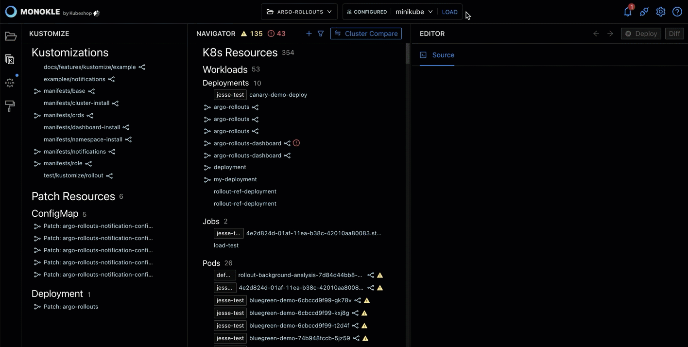

# Feature Overview

Here is a short list of some of the features currently in Monokle.

A big thanks to the excellent [Argo-Rollouts](https://github.com/argoproj/argo-rollouts/) project on GitHub for
providing plentiful manifests for us to run Monokle against.

## **Navigate k8s Objects Easily**

Monokle compiles a list of all the objects in your repo (from files you didn't want ignored), to give you a handy
overview of all your resources - [read more here](resource-navigation.md).

## **Validate and Follow Links Up- or Downstream through your Manifests**

Surf up- or downstream through your resources! Monokle highlights other resources that your selection has direct
relations to and even provides you with the links to go to them quickly - [read more here](resource-navigation.md).

## **Preview Resources Generated by Kustomize and Helm**

Do a quick dry-run, enabling you to navigate and debug the resources created by Kustomize or Helm. Apply them to
the cluster when you are satisfied - read more about [Kustomize](kustomize.md) and [Helm](helm.md).

## **Locate Source File Quickly and Find Dead-end Links**

When you select a resource, Monokle will show which file it was defined in. A yellow warning triangle indicates that a resource is pointing to a link that does not exist.

## **Browse and Update Cluster Objects**

Want to browse your cluster instead of a repo? Simply click the "Load" button to import all objects from
the cluster into Monokle - [read more](cluster-integration.md). If you need to make any immediate hot-fixes, simply modify
the resource in the source editor and click the "Apply" button.

## **Manage Multiple Projects**

Easily switch in between projects to more efficiently work with multiple projects at the same time.

## **Diff Multiple Resources**

When a resource is selected in the navigator, the Editor contains a **Diff** button at the top right.

Selecting **Diff** will compare the selected resource against the currently configured cluster:

  - If the resource does not exist in the cluster an error will be shown.
  - If the resource _does_ exist the Diff dialog will be shown.

In the screenshot above:

- The left side shows the resource in Monokle.
- The right side shows the resource retrieved from the cluster.
- Differences are highlighted as shown.

## **Create a Resource from a Template**

Monokle allows the use of templates to start a new project via the **Start from a template** option:

The **Create a Project from a Template** dialog appears:

Name your project, select its location and click **Next: Select a Template**.

Monokle includes a default set of templates which are installed automatically when starting Monokle
for the first time and available in the Templates Explorer when working with your Monokle projects:

Check out the [Monokle Default Templates Plugin](https://github.com/kubeshop/monokle-default-templates-plugin) repository to 
see the complete list of templates that are included along with their corresponding schemas and manifests.

