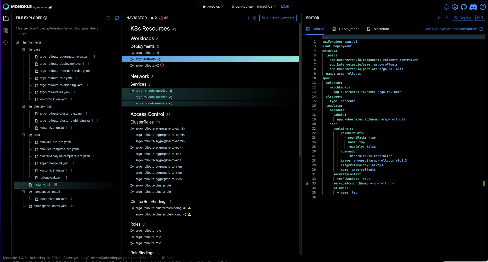
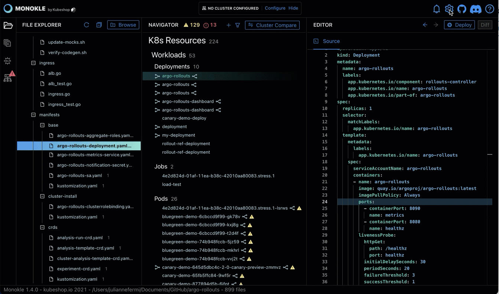
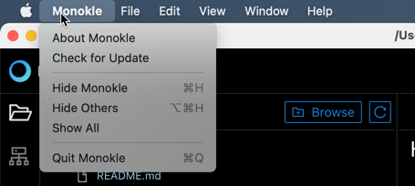
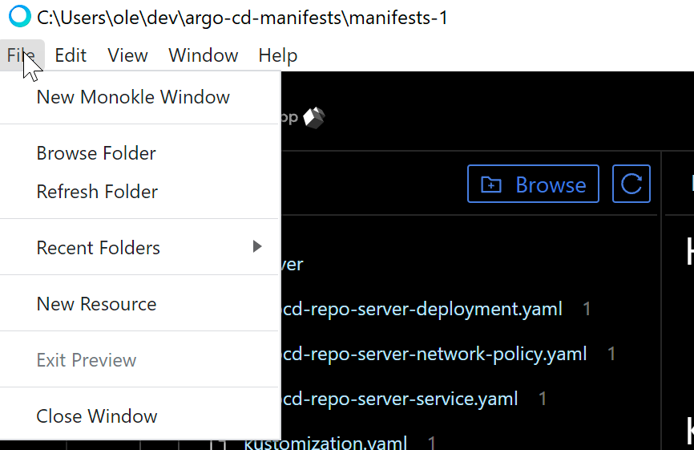
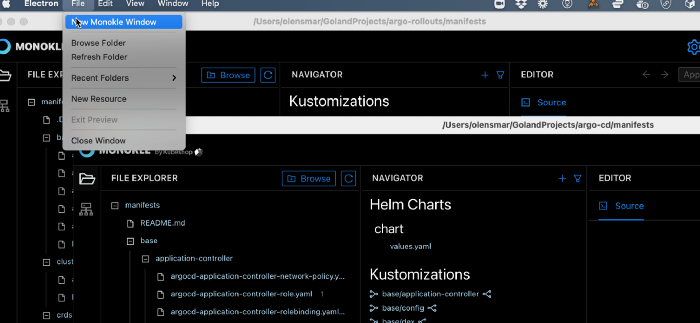
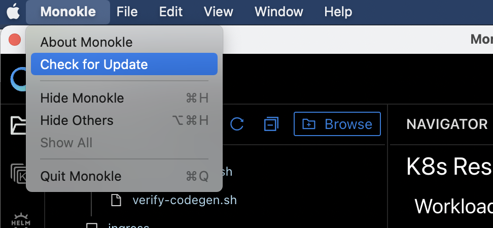

# UI Overview

Monokle is laid out like many other desktop applications:

(On start-up, Monokle automatically loads the most recently selected folder or cluster.)

Left to right:

- The vertical toolbar to the far left allows you to switch between File, Kustomize, Helm and Cluster mode.
- The File Explorer (shown in screenshot) shows the contents of the currently selected folder.
- The Navigator in the center shows all resources found in the current folder or cluster. By default it shows all possible
  Resource sections and subsections - when selecting a folder or cluster only those sections that actually contain
  any resources will be shown.
- The Editor section to the right contains editors/views/actions for the currently selected resource or file.

The top right contains the following buttons:

- Settings (see below)
- GitHub -> opens the Monokle GitHub repo in your system browser.
- Help -> opens the Monokle documentation in your system browser.

## Settings

Clicking the Settings icon on the top right opens the settings:

- **Kubeconfig**: Sets which kubeconfig Monokle should use for all cluster interactions.
- **Files: Include**: Sets which files to parse for kubernetes resources when scanning folders.
- **Files: Exclude**: Sets which files/folders to exclude when scanning folders for resources.
- **Helm Preview Mode**: Sets which Helm command to use for generating previews (see [Working with Helm Charts](helm.md)).
  - Template: uses [Helm Template](https://helm.sh/docs/helm/helm_template/)
  - Install: uses [Helm Install](https://helm.sh/docs/helm/helm_install/)
- **Kustomize Command**: Sets how to invoke kustomize when previewing and applying kustomization file.
  - Use kubectl
  - Use kustomize
- **On Startup**:
  - Automatically load last folder: will do just that on startup!
- **File Explorer**:
  - Hide excluded files: Removes files designated in the 'Files: Exclude' setting from File Explorer.
- **Maximum folder-read recursion depth**: configures how "deep" Monokle will parse a specified folder (to avoid going too deep).
- **Resource links processing**: 
  - Ignore optional unsatisfied links

## System Menu

Monokle provides a system menu with common File/Edit/View/Window/Help functionality.

Mac System Menu:

Windows System Menu:

## Multiple Windows

You can launch multiple project windows using the New Monokle Windows option. This allows you to work on multiple folders or clusters simultaneously. Thus visual navigation for the recently used pages becomes simpler and faster.

**Action:** File > New Monokle Window

## Keyboard Shortcuts

Monokle currently supports the following keyboard shortcuts:

- Cluster Preview: Ctrl/Cmd I
- Settings: Ctrl/Cmd P
- Exit Preview: ESC
- Browse Folder: Ctrl/Cmd O
- Refresh Folder: Ctrl/Cmd F5
- Toggle Left Pane: Ctrl/Cmd B
- Toggle Right Pane: Ctrl/Cmd ALT B
- Save (in editors): Ctrl/Cmd S
- Navigate Back (Selection History): ALT ArrowLeft
- Navigate Forward (Selection History): ALT ArrowRight
- Open New Resource Wizard: Ctrl/Cmd N
- Apply Resource or File to cluster: Ctrl/Cmd ALT S
- Diff Resource: Ctrl/Cmd ALT D
- Open File Explorer Tab: Ctrl/Cmd Shift E
- Open Kustomization Tab: Ctrl/Cmd Shift K
- Open Helm Tab: Ctrl/Cmd Shift H
- Reset Resource Filters: Ctrl/Cmd ALT R
- Open Quick Search: Ctrl/Cmd SHIFT P

## Auto-update

The Monokle (on Mac) / Help (on Windows) system menus provide a "Check for Update" action that will check for an update
and prompt to download, if available.

