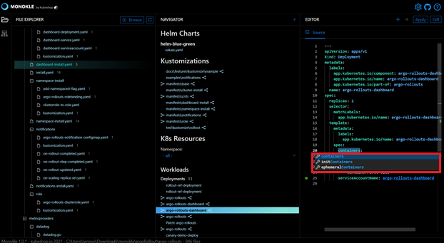
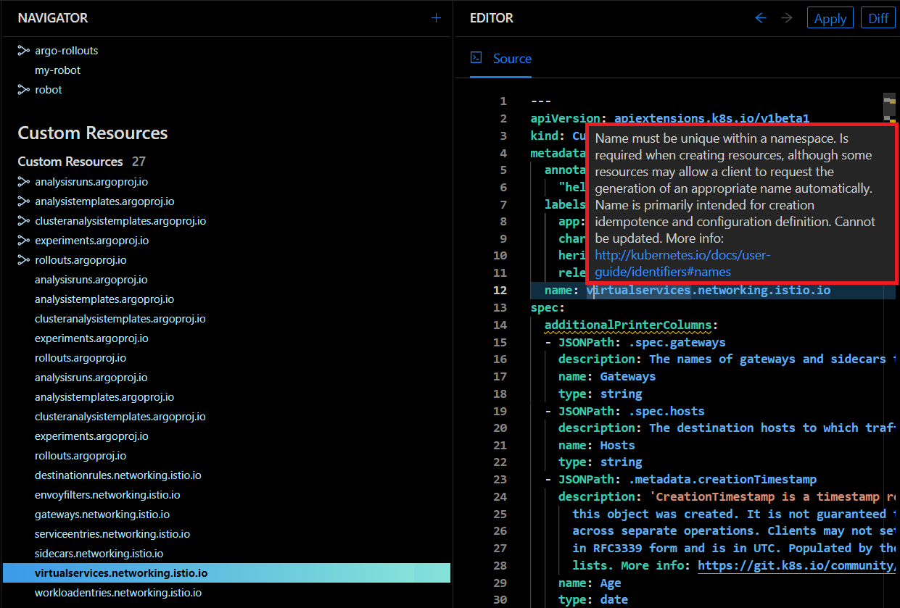
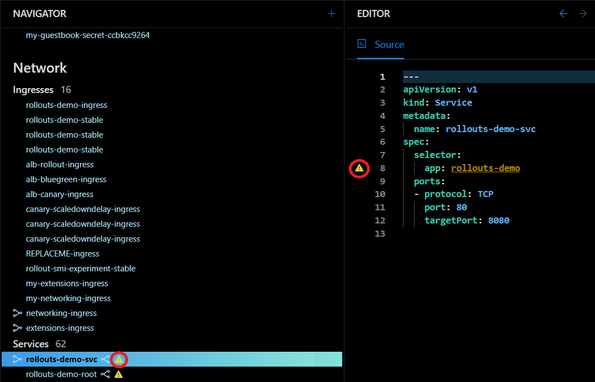
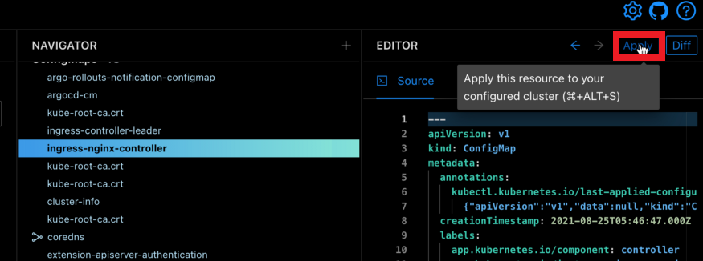

# Resource Editing

Monokle allows you to edit resource manifests either in a Source Editor

## Source Editor

Selecting either a file or resource will show its contents in the source editor to the right. The editor will syntax-highlight for
yaml and provide context-sensitive help and auto-complete functionality for standard kubernetes objects.

Right-clicking in the editor shows a list of available commands - and pressing F1 opens its command-palette:

### Editing Resources

When editing resources (not files) the editor is schema-aware for all native Kubernetes resources, which provides
auto-complete (Ctrl-Space) and context-sensitive hover documentation

#### Resource Links

Resource links are marked in the gutter and underlined in the editor, with corresponding hover/popup windows to show linked resources:

Broken links are shown with yellow triangles as in the Navigator:

## Add Resource

While using Monokle, you can directly add new K8s resources. Once you have browsed and added your project folder, click on the “New Resource” button at the top of the navigator to launch the “Add New Resource” dialog.

For adding resources to new or existing files in the navigator, click on the Save button at the top-right corner of the interface.

## Edit Resources in Cluster

You can easily view and edit resources from clusters. After making changes in a resource, you can quickly apply them back to the cluster.

#### Saving changes

The [Save] button on top of the editor will be enabled if valid changes have been made - invalid yaml will not be savable.
Saving a resource will update the containing file correspondingly and recalculate all affected ingoing/outging links for
the resource.

### Editing Files

When editing files directly by selecting them in the File Explorer the editor will at this point not show any links or provide 
context-sensitive editing functionality.

## Form Editor

To start with Monokle only shows a Form Editor for ConfigMap resources:

The editor provides form fields for key ConfigMap properties, allowing you to edit/discover all available properties without 
having to learn or lookup the corresponding yaml/resource documentation. Any changes made and saved (with the Save button on the top right)
are written back to the underlying yaml. Check out [this tutorial](tutorials/how-to-create-and-edit-configmap.md) for more details 
on how to use the Form editor for ConfigMaps.

## Rename Resource

You can rename resources and update all the references associated with that resource to ensure the integrity of that link.

## Clone Resource

You can use clone action to create a new resource by using existing resources as a template. 

## Delete Resource

You can use the delete action in the cluster mode to delete the resource from the actual cluster. 

## Resource Template

While creating a resource, it is possible to select an existing resource as a template from the drop-down menu. 

