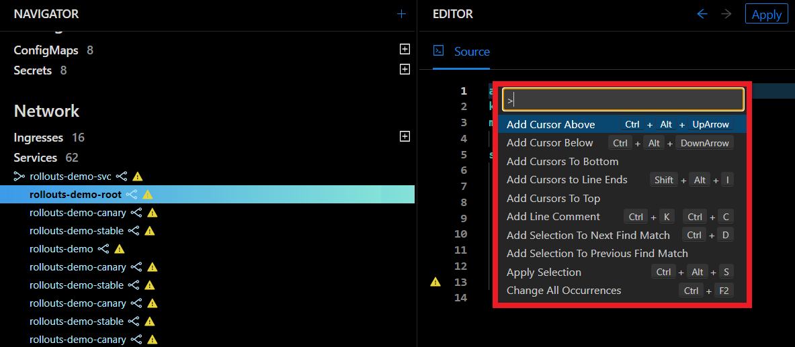
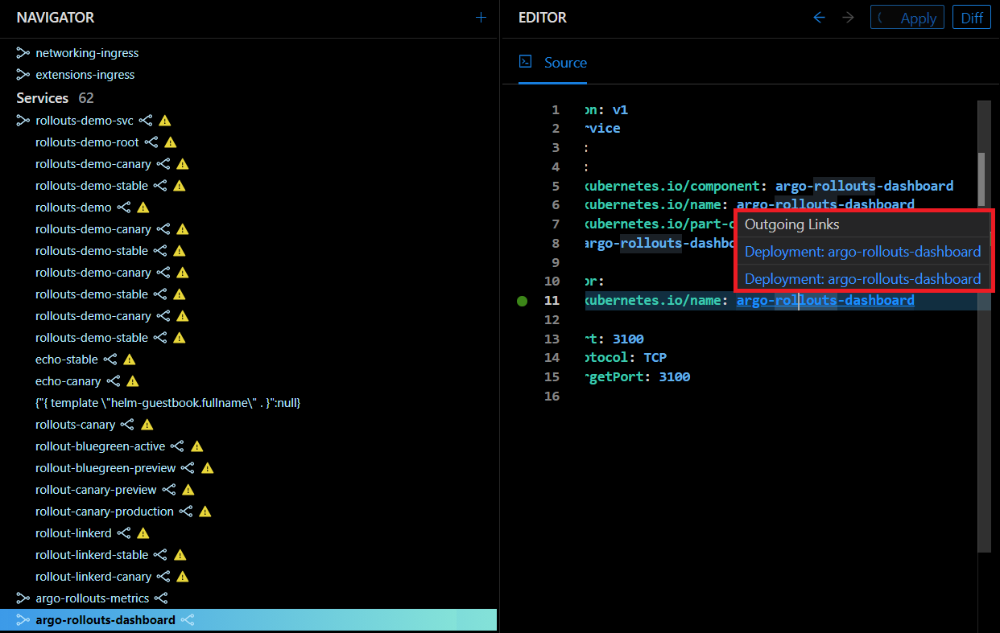
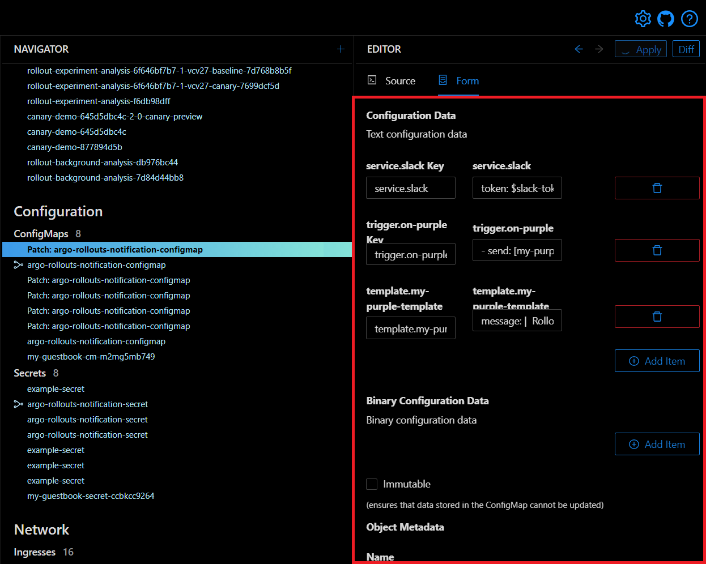

# Editing

## Source Editor

Selecting either a file or resource will show its contents in the source editor to the right. The editor will syntax-highlight for
yaml only at this point.

Right-clicking in the editor shows a list of available commands - and pressing F1 opens its command-palette:

### Editing Resources

When editing resources (not files) the editor is schema-aware for all native Kubernetes resources, which provides
auto-complete (Ctrl-Space) and context-sensitive hover documentation

#### Resource Links

Resource links are marked in the gutter and underlined in the editor, with corresponding hover/popup windows to show linked resources:

Broken links are shown with yellow triangles as in the Navigator:

#### Saving changes

The [Save] button on top of the editor will be enabled if valid changes have been made - invalid yaml will not be savable.
Saving a resource will update the containing file correspondingly and recalculate all affected ingoing/outging links for
the resource.

### Editing Files

When editing files directly by selecting them in the File Explorer the editor will at this point not show any links or provide 
context-sensitive editing functionality.

## Form Editor

To start with Monokle only shows a Form Editor for ConfigMap resources:

The editor provides form fields for key ConfigMap properties, allowing you to edit/discover all available properties without 
having to learn or lookup the corresponding yaml/resource documentation. Any changes made and saved (with the Save button on the top right)
are written back to the underlying yaml.

