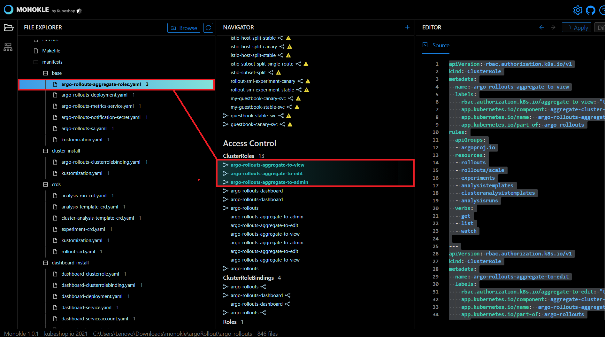
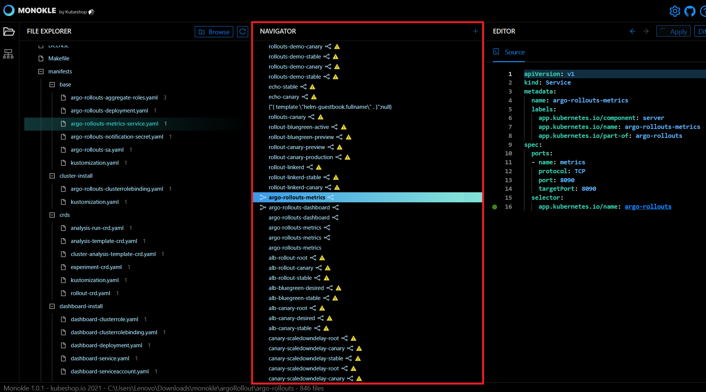
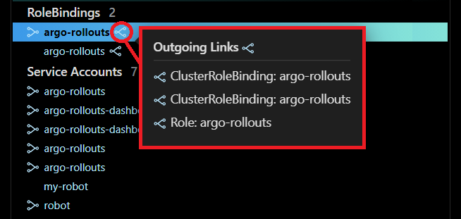

# Resource Navigation

Resources can be loaded either from the file system or a configured cluster. 
- Selecting the "Browse" button in the File Explorer prompts for a folder containing resource manifests
- Selecting "Show Cluster Objects" in the Cluster Explorer loads available resources using the configured kubeconfig  
  variable, see [Cluster Preview](cluster-integration.md) for more details

Once selecting a folder the File Explorer and Navigators will be populated accordingly. Monokle will attempt to synchronize 
automatically with any external file/folder changes made in the selected folder, but the Refresh button next to the Browse button
allows for manual reloading of the folder if needed.

## File Explorer

- The File Explorer now shows all files parsed in the specified folder
  - excluded files are greyed out
  - files containing resource manifests have a number displayed after them, showing the number of 
    resources found in that file

Selecting a file will highlight contained resources in the Navigator and attempt to scroll them into view. The contents of the 
file will be shown in the source editor to the right - allowing for direct editing of the file.

In this screenshot
- the argo-rollouts-aggregate-roles.yaml file is selected - the "3" after the filename indicates it contains 3 kubernetes resources
- the 3 ClusterRole resources in thie file are highlighed in the Navigator in the middle
- the contents of the file are shown in the editor to the right

## Resource Navigator

The Navigator shows all resources found recursively in the selected folder. Resources are grouped into sections/subsections based
on their usage in Kubernetes. Selecting a resource automatically highlights both the file containing that resource and
any other resourced linked to the selected one:

In this screenshot 
- the `argo-rollouts-metrics` service is selected
- the associated `argo-rollouts-metrics-service.yaml` file is highlighted to the left
- the linked `argo-rollouts` Deployment (via the selector in the Service manifest) is highlighted 
- the Service manifest is shown in the editor to the right (with highlighting of the link to the Deployment on line 16)

## Resource Links

Links between resources are indicated by link icons to the left and right each resource name:
- Links to the left indicate there are incoming link to the resource, for example a ConfigMap might
  have an incoming link from a Deployment
- Links to the right indicate there are outgoing links from the resource, for example a Service might have a
  selector that selects a Deployment

Hovering over a link icon will show a popup with all links (either incoming or outgoing) allowing you to click on 
a link to take you to that resource in the navigator:

Here the popup shows the outgoing link from the `argo-rollouts-metrics` Service to the `argo-rollouts Deployment 
(via the selector in the Service manifest)

If a link is "unfulfilled", i.e. not referring to any object currently in the navigator it is marked with a warning 
triangle - making it easy to identify broken resource-links in your manifests:

In this screenshot the `argo-rollouts-role-binding` RoleBinding contains a reference to an `argo-rollouts-role` Role, which
doesn't exist in the current manifests.

## Resource Validation

Monokle automatically validates all resources of the corresponding kubernetes 1.22.1 schemas. The resource which is not validated is shown with a red error icon in the navigator. You can click on the error information button to check the error details.

## Resource Filtering

Resource filters allows you to filter the resources based on various properties such as:

1. Name
2. Kind
3. Namespace
4. Labels
5. Annotations

Click on the filter button on the top of the navigator to launch the dialog for configuration.

## Reload Folder On Startup

You can choose to reload the last reviewed folder while launching Monokle. For this purpose, you will have to navigate to the Settings and simply tick the Automatically Load Last Folder checkbox.

## Navigation History

You can easily navigate back and forth between the selected resources with the help of the Navigation button.

## Expand/Collapse Sections

In resource navigator, you can expand or collapse individual or all sections in the resource navigator.

## Recent Folders

The recent Folders option has been added to the system menu to make it easy to switch between your favorite resource-manifest folders. 

**Action:** File > Check for Update

## Supported Resource links

Monokle currently finds and visualizes the following links between kubernetes resources - please let us know if
we missed something or got it wrong!

| Resource Type | Outgoing Link(s) identified |
|:-------------|:---------------------------|
| Secret | `metadata.annotations.kubernetes.io/service-account.name` => ServiceAccount `metadata.name` (optional)
| Service |  `content.spec.selector` =>  Deployment `spec.template.metadata.labels``
| PodSpec in Deployment / Pod / DaemonSet / Job / StatefulSet / ReplicaSet / CronJob / ReplicationController |  `..configMapRef.name` => ConfigMap `metadata.name`, `..configMapKeyRef.name` => ConfigMap `metadata.name`, `..volumes[*].configMap.name` => ConfigMap `metadata.name`, `..volumes[*].secret.secretMame` => Secret `metadata.name`, `..secretKeyRef.name` => Secret `metadata.name`, `..imagePullSecrets` => Secret `metadata.name`, `..serviceAccountName` => ServiceAccount `metadata.name` 
| ServiceAccount | `..secrets` => Secret `metadata.name` 
| PersistentVolume | `spec.claimRef.name` => PersistentVolumeClaim `metadata.name`
| PersistentVolumeClaim| `spec.volumeName` => PersistentVolume `metadata.name`
| Endpoints| `metadata.name`  => Service `metadata.name`
| ClusterRoleBinding| `roleRef.name` => ClusterRole `metadata.name`
| RoleBinding| `roleRef.name` => ClusterRoleBinding or Role `metadata.name`
| Ingress| `..backend.service.name` => Service `metadata.name`, `..resource.*` => any object in same namespace

