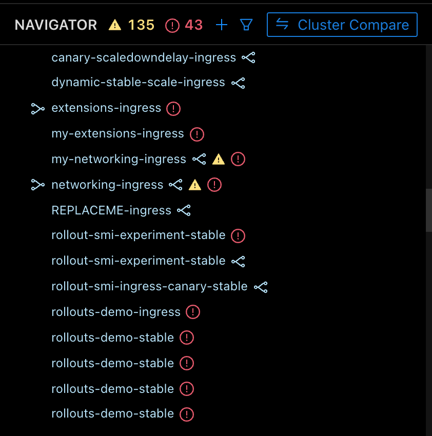
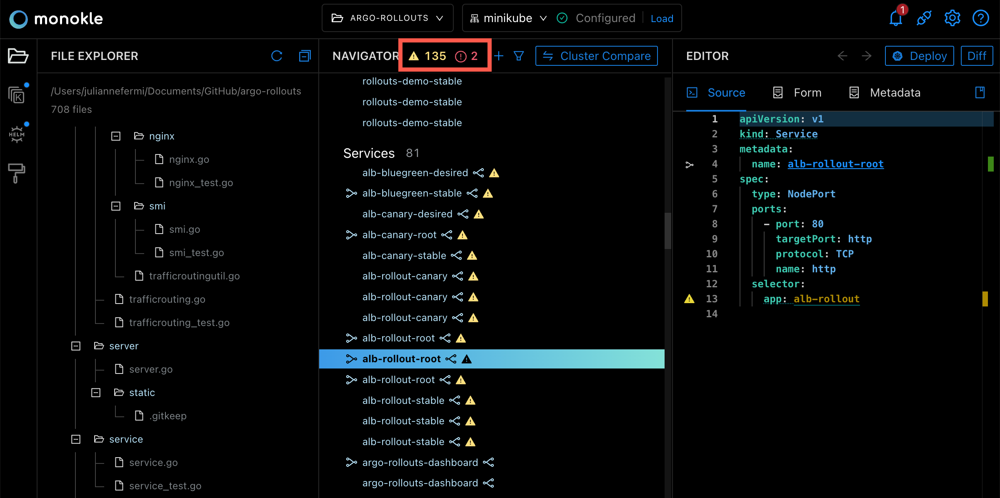
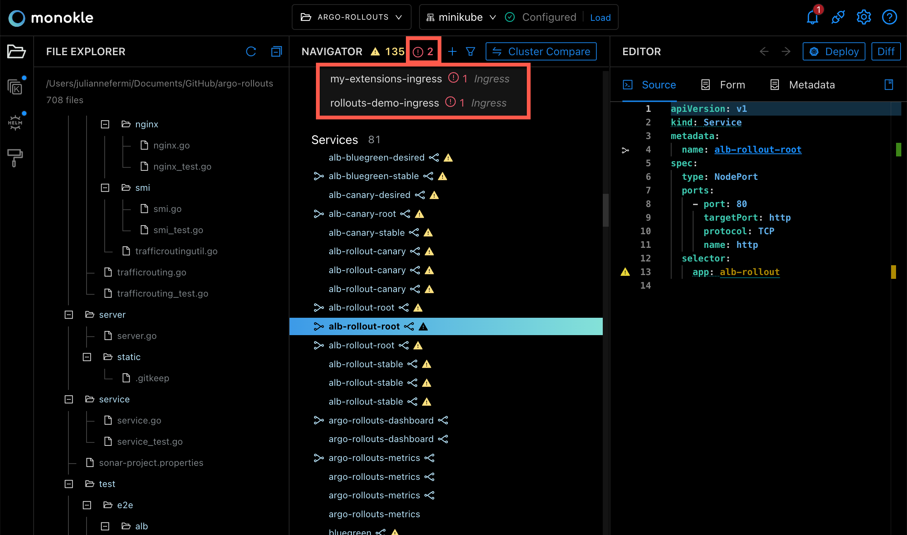
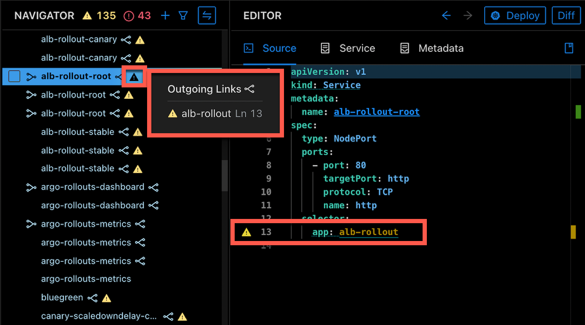

# Validating Resources

Monokle automatically validates all resources of the corresponding Kubernetes 1.22.1 schemas. In the Navigator, a resource which is not validated is shown with a red error icon. A resource with a broken link is shown with a yellow triangle.

## **Inspecting Link and Syntax Validation Errors**

You will see the number of both link and syntax validation errors in resources at the top of the Navigator:

Click on the yellow triangle to see a list of the broken links in the current resources:

Click on the red circle to see a list of syntax errors in the current resources:

Clicking on any item in the broken link or syntax error list will locate the file where the error exits in the Navigator and open the source in the Editor.

This same functionality is available when the error icons are next to the file names in the Navigator:

Hover on the error icon to check the error details and see the corresponding line in the Editor:

## **Inspecting Policy Errors**

Monokle now integrates with the Open Policy Agent and is able to use Rego policies to validate your resources. This means that validation now goes beyond syntax validation and also ensures that semantics are correct. For example, you can enable a policy that ensures that images no longer use the `latest` tag.

Let's have a look at how you would configure and remediate violations.

When you look at the left sidebar, you will notice that a new icon is available for resource validation. Clicking on the icon will open a drawer:

This is the new home for all modules related to validation. Continue by clicking on the Open Policy Agent integration and you will see a set of rules:

Here you can familiarize yourself with the rules that are available. We recommend enabling all of them and afterwards disabling those that generate too much noice for your use cases.

Great! Policy validation is now enabled. Policy errors have the same behavior as syntax errors. This means that you will see a red error icon appear whenever a violation is detected.

After opening the resource in your editor, you will notice that the error is also marked in gutter and highlighted. Hovering over the error will show you help on how to remediate the violation. Use this information to directly edit your resource and the errors will disappear in real-time.

### Policy rules

A big shout out to the DefSec team at [Aqua Security][aqua] as full credit for these rules goes to them. You can find the source of the Rego policies [here][aqua-defsec].

An overview of available rules:

| Rule   | Description                              | Severity |
| ------ | ---------------------------------------- | -------- |
| KSV001 | Process can elevate its own privileges   | medium   |
| KSV002 | Default AppArmor profile not set         | medium   |
| KSV003 | Default capabilities not dropped         | low      |
| KSV005 | SYS_ADMIN capability added               | high     |
| KSV006 | hostPath volume mounted with docker.sock | high     |
| KSV008 | Access to host IPC namespace             | high     |
| KSV009 | Access to host network                   | high     |
| KSV010 | Access to host PID                       | high     |
| KSV011 | CPU not limited                          | low      |
| KSV012 | Runs as root user                        | medium   |
| KSV013 | Image tag ':latest' used                 | low      |
| KSV014 | Root file system is not read-only        | low      |
| KSV015 | CPU requests not specified               | low      |
| KSV016 | Memory requests not specified            | low      |
| KSV017 | Privileged container                     | high     |
| KSV018 | Memory not limited                       | low      |
| KSV020 | Runs with low user ID                    | low      |
| KSV021 | Runs with low group ID                   | medium   |
| KSV023 | hostPath volumes mounted                 | medium   |
| KSV024 | Access to host ports                     | high     |
| KSV025 | SELinux custom options set               | medium   |
| KSV027 | Non-default /proc masks set              | medium   |
| KSV028 | Non-ephemeral volume types used          | low      |
| KSV029 | A root primary or supplementary GID set  | low      |
| KSV030 | Default Seccomp profile not set          | low      |

### Policy validation FAQ

**How does it work?**

Under the hood, Rego policies are compiled to web assembly. Monokle uses [the opa-wasm NPM module][npm-opa-wasm] to load the policy and evaluate your resources in real-time.

**Can I use this with Helm and Kustomize?**

No, in this first release only vanilla Kubernetes resources are validated. Let us know if this is something you need by liking our related [Helm][github-validate-helm] and [Kustomize][github-validate-kustomize] GitHub issue.

**Can I use my own Rego policies?**

No, currently only a set of preconfigured rules is available. We are considering [policy plugins][github-custom-rego] or [an OPA Gatekeeper integration][github-opa-gatekeeper], feel free to let us know if this is something you'd like!

[npm-opa-wasm]: https://www.npmjs.com/package/@open-policy-agent/opa-wasm
[aqua]: https://www.aquasec.com/
[aqua-defsec]: https://github.com/aquasecurity/defsec
[github-validate-helm]: https://github.com/kubeshop/monokle/issues/1696
[github-validate-kustomize]: https://github.com/kubeshop/monokle/issues/1695
[github-custom-rego]: https://github.com/kubeshop/monokle/issues/1697
[github-opa-gatekeeper]: https://github.com/kubeshop/monokle/issues/1698
